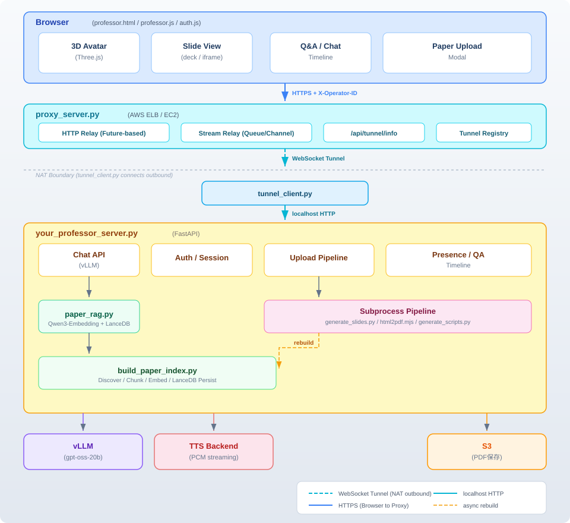

# Professor LT System -- 設計ドキュメント

論文 PDF をアップロードすると、スライド生成 → スピーカースクリプト生成 → RAG インデックス構築を経て、3D アバター付きのライブ研究発表を行う AI プレゼンテーションシステム。

---

## 1. システム概要



---

## 2. ファイル構成と責務

| ファイル | 役割 |
|---------|------|
| `your_professor_server.py` | FastAPI バックエンド。チャット生成、認証、ファイルサーブ、アップロードパイプライン管理 |
| `paper_rag.py` | ベクトル検索インターフェース。Qwen3-Embedding + LanceDB + CrossEncoder リランカー |
| `build_paper_index.py` | オフラインバッチインデクサー。PDF/MD/TeX を発見→チャンク→埋め込み→永続化 |
| `html/professor.html` | ブラウザ UI コンテナ。3 カラムレイアウト (アバター / スライド / Q&A) |
| `html/js/professor.js` | フロントエンドロジック。TTS 再生、アバターアニメーション、スライド遷移、アップロード UI |
| `html/js/auth.js` | Google OAuth ラッパー。ドメイン制限付きサインイン、セッション管理 |
| `~/git/paper/myboy/aws/proxy_server.py` | AWS 上のリバースプロキシ。WebSocket トンネル管理、HTTP/ストリームリレー |
| `~/git/paper/myboy/aws/tunnel_client.py` | NAT 内から Proxy へ outbound WebSocket 接続、ローカルサーバーへ���リクエスト中継 |

---

## 3. API エンドポイント

### 3.1 チャット・設定

| Method | Path | 説明 |
|--------|------|------|
| POST | `/api/chat` | LLM によるステージ別テキスト生成 (waiting/presenting/qa/closing) |
| GET | `/api/config` | TTS URL 等のブートストラップ設定 |
| GET | `/api/deck` | 静的スライドデッキ JSON (deck.json) |
| GET | `/api/history` | ユーザー別会話履歴 |
| POST | `/api/reset` | セッション履歴クリア |

### 3.2 認証

| Method | Path | 説明 |
|--------|------|------|
| POST | `/api/auth/google` | Google OAuth サインイン (mixi.co.jp + カスタム許可リスト) |
| GET | `/api/auth/check` | セッション検証 |
| POST | `/api/auth/logout` | サインアウト |

### 3.3 プレゼンス・Q&A

| Method | Path | 説明 |
|--------|------|------|
| GET | `/api/presence/users` | 参加者一覧 (オンライン状態) |
| POST | `/api/presence/heartbeat` | ハートビート (10 秒ポーリング) |
| GET | `/api/qa/timeline` | Q&A タイムライン取得 |
| PUT | `/api/qa/{qa_id}` | Q&A エントリ編集 (発表者のみ) |
| DELETE | `/api/qa/{qa_id}` | Q&A エントリ削除 |

### 3.4 論文アップロード

| Method | Path | 説明 |
|--------|------|------|
| POST | `/api/upload/presign` | S3 署名付き URL 発行 + ジョブ作成 |
| POST | `/api/upload/start` | チケット消費 → PDF ダウンロード → パイプライン開始 |
| GET | `/api/upload/jobs/{job_id}` | ジョブステータス + ログテール |
| GET | `/api/upload/jobs/{job_id}/slides` | 生成済み HTML スライド |
| GET | `/api/upload/jobs/{job_id}/script` | スピーカースクリプト JSON |
| GET | `/api/upload/papers` | 登録済み論文一覧 |
| POST | `/api/upload/papers/{job_id}/select` | 論文をアクティブに設定 |
| DELETE | `/api/upload/papers/{job_id}` | 論文削除 |
| GET | `/api/upload/eligibility` | アップロード/削除チケット残数 |
| GET | `/api/meta` | 現在の発表メタデータ (テーマ/発表者/会場) |

### 3.5 TTS プロキシ

| Method | Path | 説明 |
|--------|------|------|
| POST | `/api/tts/generate_stream` | 外部 TTS バックエンドへのストリーミングプロキシ (PCM 音声) |

---

## 4. ネットワークアーキテクチャ (Tunnel/Proxy)

ブラウザは `your_professor_server.py` に直接接続しない。
NAT 内のサーバーに外部からアクセスするため、WebSocket トンネルによるリバースプロキシ構成を取る。

```
Browser ──HTTPS──▶ proxy_server.py (AWS ELB/EC2)
                        ▲
                        │ WebSocket (NAT 内から outbound 接続)
                        │
                   tunnel_client.py ──localhost──▶ your_professor_server.py
```

### 4.1 接続フロー

1. `tunnel_client.py` が NAT 内から `proxy_server.py` へ WebSocket 接続 (outbound)
2. `register` アクションで operator_id (UUID) + display_name を登録
3. Proxy 側の `_tunnels[operator_id]` にトンネルが登録される
4. ブラウザは Proxy の `/api/tunnel/info` でリレー先一覧を取得
5. リクエスト時に `X-Operator-ID` ヘッダー or `?operator_id=` で対象トンネルを指定

### 4.2 リクエストリレー

| 種別 | 方式 | 用途 |
|------|------|------|
| 制御 (RPC) | Proxy が Future 生成 → トンネル経由で forward → レスポンスで Future 解決 | `/api/chat`, `/api/auth/*` 等 |
| ストリーム | Channel + Queue ベース、複数ブラウザで同一チャネルを共有 (マルチキャスト) | `/api/tts/generate_stream`, `/api/video/stream` |

制御リクエストのリレー:
```
Browser → Proxy: HTTP request
Proxy → Tunnel: {"action": "forward", "request_id": uuid, "method": ..., "path": ..., "body_b64": ...}
Tunnel → Local Server: httpx.AsyncClient.request(localhost)
Tunnel → Proxy: {"action": "response", "request_id": uuid, "status": ..., "body_b64": ...}
Proxy → Browser: HTTP response (15秒タイムアウト)
```

### 4.3 Operator ルーティング

| 優先度 | 方式 |
|--------|------|
| 1 | `X-Operator-ID` ヘッダー |
| 2 | `?operator_id=` クエリパラメータ |
| 3 | パスベースの role マッチング (`/api/video/*` → device, その他 → gameserver) |
| 4 | フォールバック: 最初の利用可能なトンネル |

---

## 5. コアデータフロー

### 5.1 ライブ発表フロー

```
1. ブラウザ起動
   → /api/auth/check → /api/config → /api/deck → /api/upload/papers
   → /api/presence/heartbeat (10秒毎)

2. ユーザーが「Speak」クリック
   → POST /api/chat {stage: "presenting", slide: {title, bullets}}
   → サーバー: build_prompt_messages()
      ├── システムプロンプト (ペルソナ=著者+所属, テーマ)
      ├── [Stage] セクション
      ├── [Slide] セクション (タイトル + バレットポイント)
      ├── [Knowledge Context] (paper_rag.search 結果, top_k=5)
      └── 直近100ターンの履歴 (連続同一ロールはマージ)
   → vLLM 推論 (Harmony エンコーディング, analysis → final チャネル)
   → レスポンス: {reply, stage, slide_page, voice}

3. TTS 再生
   → sanitizeForTTS() → splitForTTS() (~40文字チャンク)
   → 各チャンク: POST /api/tts/generate_stream → PCM ストリーム
   → Web Audio API で逐次再生 + アバターアニメーション切替
```

### 5.2 挙手 (Q&A) フロー

```
1. 発話中にユーザーが「挙手」クリック
   → TTS 中断 → 確認フレーズ再生 → 質問入力待ち

2. 質問入力 + Ask
   → POST /api/chat {stage: "qa", message: "【聴衆からの質問】..."}
   → RAG 検索 (top_k=2) + LLM 推論 → TTS 再生
   → 再開フレーズ ("それでは、発表を続けさせていただきます。")

3. 30秒間入力なし → 自動再開
```

### 5.3 論文アップロードパイプライン

```
1. ブラウザ: PDF 選択 → POST /api/upload/presign
   → S3 署名付き URL + job_id 発行

2. ブラウザ: PUT PDF → S3 直接アップロード

3. POST /api/upload/start {job_id}
   → チケット消費 (アトミックファイルリネーム)
   → バックグラウンドタスク起動

4. バックグラウンド処理:
   a. S3 から PDF ダウンロード → professor_data/uploads/{job_id}/
   b. 外部コーパスディレクトリへコピー
   c. Knowledge Context 構築
      - PDF 冒頭テキスト抽出
      - LLM (gpt-5.2) でクエリリライト (日本語3 + 英語3 = 6クエリ)
      - paper_rag.search() × 各クエリ → 自己参照除外 → 重複排除
      - knowledge_context.md 書き出し
   d. generate_slides.py (PDF → HTML スライド + essence メタデータ)
   e. html2pdf.mjs (HTML → PDF 中間ファイル)
   f. generate_scripts.py (PDF + スライドPDF → スピーカースクリプト)
   g. current_meta 更新 (テーマ/発表者/所属/会場 → LLM ペルソナに反映)
   h. RAG インデックス再構築キュー投入

5. ブラウザ: 10秒ポーリング → ログ表示 → 完了時 iframe にスライド表示
```

### 5.4 RAG インデックス再構築

```
FIFO キュー (単一ワーカー) で逐次実行:
1. build_paper_index.py (サブプロセス)
   → ファイル発見 → テキスト抽出 → チャンク分割 → 埋め込み → LanceDB 永続化
2. paper_rag.reload_index()
   → 新しい埋め込みモデル + インデックスをロード
   → _swap_lock 下でアトミックスワップ (検索中のリクエストは旧スナップショット参照)
```

---

## 6. RAG アーキテクチャ

### 6.1 インデックス構築 (build_paper_index.py)

| ステップ | 詳細 |
|---------|------|
| 発見 | `~/git/paper` (自分の論文・メモ + `external-pdf-for-rag/` 内の外部論文) + `professor_data/uploads` を再帰走査。PDF/MD/TeX/TXT 対象 |
| 分類 | パスからメタデータ推定: doc_type (paper/preprint/patent/memo/tool/other), topic, title |
| テキスト抽出 | PDF: PyMuPDF、MD/TeX/TXT: UTF-8 読み込み |
| チャンク分割 | 段落認識、~600 トークン/チャンク、~100 トークンオーバーラップ |
| 埋め込み | Qwen/Qwen3-Embedding-0.6B、バッチサイズ 8、正規化あり |
| 永続化 | LanceDB `chunks` テーブル (upsert) + `meta.json` マニフェスト |

### 6.2 検索 (paper_rag.py)

```
search(query, top_k=5)
  ├── Qwen3-Embedding-0.6B でクエリ埋め込み (CPU)
  ├── LanceDB ベクトル検索 (top_k=10 オーバーサンプル)
  ├── CrossEncoder リランク (BAAI/bge-reranker-v2-m3, CPU)
  └── 上位 top_k 件を返却: [{title, source, text, score}]
```

- **デバイス戦略**: 埋め込み・リランクともに CPU (vLLM GPU と競合回避)
- **スレッド安全**: `_swap_lock` でリロード中の検索は旧スナップショットを参照
- **グレースフルデグラデーション**: インデックス未構築時は空リスト返却、LLM はスライド内容のみで生成

---

## 7. LLM プロンプト設計

### 7.1 システムプロンプト

ペルソナは論文ごとに動的に切り替わる。essence メタデータから `著者` / `所属` を抽出し、
システムプロンプトの冒頭に注入する。

| 条件 | プロンプト例 |
|------|-------------|
| 著者+所属あり | 「あなたは 山田太郎(東京大学 所属)本人として、研究発表(LT)をおこなう。」 |
| 著者のみ | 「あなたは 山田太郎 本人として、研究発表(LT)をおこなう。」 |
| 未設定 (フォールバック) | 「あなたは D.Sugisawa(杉澤 大輔, mixi.co.jp 所属)本人として、研究発表(LT)をおこなう。」 |

`current_meta` には `theme` / `presenter` / `affiliation` / `venue` の 4 フィールドがあり、
論文選択 (`/api/upload/papers/{job_id}/select`) のたびに更新される。

ステージ別指示:

| ステージ | 指示 |
|---------|------|
| waiting | タイトル案内、「もう少ししたら開始」(1-2 文) |
| presenting | スライド内容を順序立てて説明 (3-6 文)、Knowledge Context 参照可 |
| qa | 質問意図を捉え直接応答 (3-5 文)、範囲外は率直に申告 |
| closing | 「ご清聴ありがとうございました」(1 文) |

出力ルール (TTS 前提):
- 自然な日本語話し言葉
- マークダウン記号・箇条書き・絵文字・コードブロック禁止
- 数式は言葉で説明
- 定着略語 (TCP, RTT 等) はそのまま、馴染みない記号は言い換え

知識ソース:
- `[Knowledge Context]` は RAG コーパスからの検索論文粋として参照
  - コーパスには自分の論文・メモだけでなく、過去にアップロードされた外部論文 (IPSJ 研究会等) も含まれる
  - アップロード時に `external-pdf-for-rag/` へ自動ミラーされ、次回インデックス再構築で取込まれる
- 論文粋にない数値・主張の捏造禁止
- `[Slide]` と矛盾時はスライド優先

### 7.2 RAG クエリリライト (アップロード時)

gpt-5.2 で PDF 冒頭テキストから 6 クエリ生成:
- 3 観点 (methods / domain / evaluation) x 2 言語 (日本語 / 英語)
- 出力: `{summary, summary_en, queries_ja: [3], queries_en: [3]}`

---

## 8. フロントエンド設計

### 8.1 レイアウト (3 カラム)

| カラム | 幅比 | 内容 |
|-------|------|------|
| 左 | 40% | 3D アバター (Three.js GLB モデル + 背景パターンアニメーション) |
| 中央 | 238% | スライドビューア (deck.json or iframe) + スピーカースクリプトペイン |
| 右 | 72% | 参加者サイドバー + Q&A タイムライン |

### 8.2 TTS パイプライン

```
テキスト → sanitizeForTTS() → splitForTTS() → speakChunk() × N
                                   │
                         ~40文字チャンク (。、で分割)
                         最大80文字制限
```

- Web Audio API (lazy allocate, Safari/iOS resume 対応)
- チャンク間ギャップ/オーバーラップ回避 (nextStartTime 計算)

### 8.3 アバターアニメーション

- Three.js AnimationMixer + GLB クリップ
- 2 プール: idle / speaking (フェード遷移 250ms)
- `finished` イベントで現在のプールから次クリップ選択

### 8.4 自動進行ロジック

```
スライド発話完了
  → 「コメント、質問等ございますでしょうか」 (8秒待機)
  → 挙手なし → 「次に進めたいと思います」 (3秒待機)
  → 自動 Next クリック → 次スライドのスクリプト再生
```

---

## 9. 認証・アクセス制御

- **Google OAuth**: mixi.co.jp ドメイン制限 + `.custom-auth.txt` カスタム許可リスト
- **チケットシステム**: アップロード/削除はシングルユースチケット (ファイルリネームによるアトミック消費)
  - `.ticket.available` → `.ticket.consumed` (成功時)
  - 同時消費はリネーム競合で一方のみ成功 (レースセーフ)

---

## 10. 状態管理

| データ | 保存先 | 永続性 |
|--------|--------|--------|
| 会話履歴 | `professor_data/sessions/{user_id}.json` + メモリ | 永続 (presenting のみ) |
| 参加者 | メモリ (`participants` dict) | プロセス内のみ |
| Q&A | メモリ (`_qa_id_counter` + participants[].qa) | プロセス内のみ |
| アップロードジョブ | メモリ + ディスク成果物 | 再起動時 rehydrate |
| 発表メタ | `current_meta` dict (theme/presenter/affiliation/venue) | プロセス内 (select 時更新) |
| ユーザー登録 | `professor_data/users.json` | 永続 |
| RAG インデックス | `professor_data/index/` (LanceDB + meta.json) | 永続 |
| チケット | `professor_data/tickets/` | ファイルベース永続 |

---

## 11. ステートフル/ステートレス設計判断

| ステージ | 種別 | 理由 |
|---------|------|------|
| presenting | ステートフル (履歴永続化) | スライド間で重複説明を避けるため |
| waiting / qa / closing | ステートレス (エフェメラル) | 独立生成、長い回答が挨拶にエコーされるのを防止 |

---

## 12. 外部依存

| サービス | 用途 | 設定 |
|---------|------|------|
| vLLM (gpt-oss-20b) | テキスト生成 | Harmony エンコーディング、analysis → final チャネル |
| TTS Backend | 音声合成 | `http://192.168.124.251:8889`、PCM ストリーミング、10 秒タイムアウト |
| S3 (monst-static-assets) | PDF アップロード保存 | `professor_uploads/`、署名付き URL (300 秒)、最大 30MB |
| proxy_server.py (AWS ELB) | リバースプロキシ / トンネルレジストリ | WebSocket トンネル経由でリレー |
| tunnel_client.py | NAT 内 → Proxy outbound 接続 | `PROXY_WS_URL` で接続先指定 |
| generate_slides.py | PDF → HTML スライド生成 | サブプロセス実行 |
| html2pdf.mjs | HTML → PDF 変換 | Puppeteer/Chromium |
| generate_scripts.py | スピーカースクリプト生成 | サブプロセス実行 |

---

## 13. エラーハンドリング・グレースフルデグラデーション

| 障害 | 挙動 |
|------|------|
| RAG 未構築 / ロード失敗 | `search()` → 空リスト、LLM はスライド内容のみで生成 |
| TTS タイムアウト | AbortError キャッチ、バッファ済み音声はそのまま再生 |
| S3 障害 | ジョブを error 状態に、チケット未消費 (ロールバック) |
| サブプロセス失敗 | ログテール保存、モーダルに終了コード + エラー表示 |
| チケット競合 | リネーム失敗側が FileNotFoundError → 403 |
| Knowledge Context 構築失敗 | None 返却、パイプライン続行 |
| クエリリライト LLM 失敗 | PDF 冒頭テキストでの単一クエリにフォールバック |

---

## 14. 環境変数一覧

### サーバー (your_professor_server.py)

```
PRESENCE_TIMEOUT_S=30
QA_TIMELINE_MAX=200
TTS_BACKEND=http://192.168.124.251:8889
TTS_TIMEOUT_S=10
S3_UPLOAD_BUCKET=monst-static-assets
S3_UPLOAD_PREFIX=professor_uploads/
S3_UPLOAD_REGION=ap-northeast-1
S3_PRESIGN_TTL_S=300
UPLOAD_PDF_MAX_MB=30
GOOGLE_CLIENT_ID=349549531314-...
ALLOWED_EMAIL_DOMAIN=mixi.co.jp
CUSTOM_AUTH_FILE=.custom-auth.txt
CORS_ORIGINS=*
TICKETS_DIR=professor_data/tickets
KNOWLEDGE_CONTEXT_TOP_K=8
KNOWLEDGE_REWRITER_MODEL=gpt-5.2
EXTERNAL_PDF_DIR=~/git/paper/external-pdf-for-rag
```

### RAG (paper_rag.py)

```
PAPER_RAG_DEVICE=cpu
PAPER_RAG_RERANK=1
PAPER_RAG_RERANKER=BAAI/bge-reranker-v2-m3
PAPER_RAG_RERANKER_DEVICE=cpu
```

### インデックスビルダー (build_paper_index.py)

```
--paper-dir ~/git/paper
--upload-dir professor_data/uploads
--output professor_data/index
--model Qwen/Qwen3-Embedding-0.6B
--batch-size 8
```

---

## 15. デプロイメントディレクトリ構造

```
professor_data/
├── sessions/{user_id}.json     # 会話履歴
├── index/
│   ├── lance/                  # LanceDB ベクトルストア
│   └── meta.json               # インデックスメタデータ
├── uploads/{job_id}/
│   ├── {filename}.pdf          # アップロード PDF
│   ├── presentation.html       # 生成スライド
│   ├── presentation.pdf        # 中間ファイル (スクリプト生成用)
│   ├── presentation_script.md  # スピーカースクリプト
│   ├── presentation.essence.txt
│   └── knowledge_context.md    # RAG コンテキスト
├── tickets/
│   ├── {uuid}.ticket.available
│   ├── {uuid}.ticket.remove
│   └── {uuid}.ticket.consumed
├── users.json                  # ユーザーレジストリ
└── deck.json                   # 静的スライドデッキ
```
